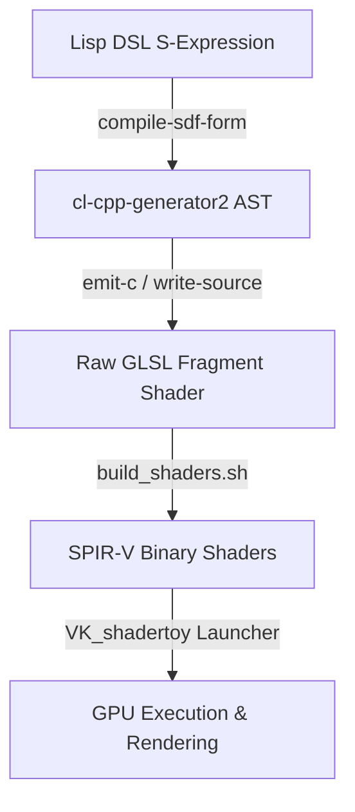

# SDF DSL Compiler - Technische Dokumentation & Entwickler-Leitfaden

Diese Dokumentation beschreibt die Architektur, Funktionsweise und Syntax des deklarativen SDF (Signed Distance Field) DSL-Compilers, der in [gen3.lisp](file:///home/kiel/stage/cl-cpp-generator2/example/197_shadertoy/gen3.lisp) implementiert ist. Das Ziel dieses Dokuments ist es, ein vollständiges, in sich geschlossenes Verständnis des Compilers zu vermitteln, ohne dass der Leser externe Fachliteratur heranziehen muss.

---

## 1. Einführung: Mathematische Grundlagen (SDFs & Raymarching)

Um die Funktionsweise des Compilers zu verstehen, müssen zuerst die beiden zugrundeliegenden Konzepte der 3D-Shader-Programmierung erklärt werden: **Signed Distance Fields (SDFs)** und **Raymarching**.

### 1.1 Signed Distance Functions (SDFs)
Eine Signed Distance Function (SDF) ist eine mathematische Funktion, die für jeden beliebigen 3D-Punkt $p = (x, y, z)$ den kürzesten Abstand zur Oberfläche eines geometrischen Objekts berechnet:

$$f(p) = d$$

Das Vorzeichen (*signed*) der zurückgegebenen Distanz $d$ verrät, wo sich der Punkt relativ zum Objekt befindet:
*   $d > 0$: Der Punkt liegt **außerhalb** des Objekts.
*   $d < 0$: Der Punkt liegt **innerhalb** des Objekts.
*   $d = 0$: Der Punkt liegt exakt **auf der Oberfläche** des Objekts.

#### Mathematisches Beispiel: Die Kugel (Sphere)
Für eine Kugel mit Radius $r$, die im Ursprung $(0,0,0)$ liegt, ist die Distanz eines Punktes $p$ zur Oberfläche die Differenz zwischen dem Abstand des Punktes zum Ursprung (der Länge des Vektors $p$) und dem Radius $r$:

$$f_{\text{Sphere}}(p) = \|p\| - r$$

Liegt die Kugel nicht im Ursprung, sondern ist um einen Vektor $t$ verschoben, transformieren wir den Raum vor der Berechnung:

$$f_{\text{Sphere}, t}(p) = \|p - t\| - r$$

Dieser Ansatz – das Transformieren des Raums statt des Objekts selbst – ist das fundamentale Prinzip für Translationen und Rotationen in SDFs.

### 1.2 Der Raymarching-Algorithmus
Da Grafikkarten (GPUs) Pixel parallel berechnen, arbeitet ein Fragment-Shader pro Pixel. Raymarching ist eine Technik, um eine 3D-Szene aus SDFs auf einen 2D-Bildschirm zu projizieren:

1.  **Strahl erzeugen:** Für jedes Pixel der Kamera wird ein Strahl (*Ray*) mit einem Ursprung $R_0$ (Kamera-Position) und einer normierten Richtung $R_d$ definiert.
2.  **Märschen (Schrittweise vortasten):** Wir tasten uns entlang des Strahls voran. Die aktuelle Position ist $p(t) = R_0 + t \cdot R_d$.
3.  **Sicherer Schritt:** An jedem Punkt fragen wir das SDF-Feld der gesamten Szene ab, wie weit das nächste Objekt entfernt ist ($d = f(p(t))$). Da sich im Umkreis von $d$ kein Objekt befinden kann, ist es absolut sicher, den Strahl um genau diese Distanz $d$ nach vorne zu bewegen ($t \leftarrow t + d$).
4.  **Treffer oder Abbruch:**
    *   Wenn $d < 0.001$ ist, haben wir die Oberfläche eines Objekts fast exakt getroffen. Wir brechen die Schleife ab und berechnen die Farbe (mittels Beleuchtung, Normalenvektoren und Schatten).
    *   Wenn $t$ die maximale Sichtweite überschreitet, brechen wir ab und zeichnen den Hintergrund.

### 1.3 Die "Grammar of SDFs" (ggplot-Analogie)
Ähnlich wie `ggplot` in R Grafiken deklarativ aus geometrischen Primitiven (`geoms`), Mappings (`aes`) und Koordinatentransformationen aufbaut, tut dies unsere Lisp-DSL für 3D-Szenen:
*   **Data:** Die 3D-Koordinaten $p$.
*   **Geoms:** Primitiv-Objekte wie Kugeln, Boxen, Zylinder und Tori.
*   **Aesthetics:** Transformationen (Rotation, Skalierung) und Deformationen (Verbiegungen, Noise-Verzerrungen).
*   **Layers:** Logische Kombinationen (CSG-Operationen wie `union` oder `difference`).

---

## 2. Systemarchitektur & Datenfluss

Der Compiler ist in die bestehende Lisp-zu-C++-Pipeline eingebettet. Er agiert als logische Schicht *über* der rohen Syntax von `cl-cpp-generator2`:



### Die zwei Ausgabe-Shader
Die Szene wird in zwei separate Shader-Dateien transpiliert:
1.  **`buf0.glsl` (State-Pass):** Berechnet und speichert interaktive Zustände (z. B. Slider-Werte) in den Pixeln eines double-buffered Texturpuffers. Tastatur- und Maus-Events werden hier verarbeitet.
2.  **`main_image.glsl` (Render-Pass):** Liest die Zustände aus `buf0.glsl` aus, führt das Raymarching über die kompilierte `map`-Funktion aus, berechnet die Beleuchtung und zeichnet die Slider-Grafik als 2D-Overlay.

---

## 3. Die Compiler-Kernfunktion (`compile-sdf-form`)

Die Kernfunktion des Compilers ist `compile-sdf-form`. Sie nimmt eine Lisp S-Expression entgegen, analysiert sie rekursiv und erzeugt Lisp-Ausdrücke, die exakt zu C++ / GLSL transpiliert werden können.

### 3.1 Strukturierte Analyse von `compile-sdf-form`
Der Compiler nutzt ein rekursives Matching-Muster (`cond`/`case`):

```lisp
(defun compile-sdf-form (form &optional (p-var 'p))
  (cond
    ((atom form) form) ; Atome (wie Variablen) werden direkt durchgereicht
    (t
     (let ((op (first form))
           (args (rest form)))
       (case op
         ;; Primitiven ...
         ;; CSG-Kombinatoren ...
         ;; Fallback für rohe Lisp-Ausdrücke ...
         )))))
```

### 3.2 Verarbeitung von Primitiven
Jedes Primitiv (z. B. `sphere`) unterstützt die Keyword-Argumente `:radius`/`:size`, `:transform` und `:deform`.
Der Compiler löst diese hierarchisch auf:

1.  **Transformation auflösen:** Falls `:transform` übergeben wurde, wird der Koordinatenraum transformiert. Die Geometrie-Form erhält dann dieses modifizierte Koordinatensystem (z. B. `p_transformed` statt `p`).
2.  **Basiskörper berechnen:** Die eigentliche SDF-Funktion (z. B. `sdSphere` oder `sdBox`) wird mit dem transformierten Punkt aufgerufen.
3.  **Deformation anwenden:** Falls `:deform` (z. B. `noise-displace`) existiert, wird die berechnete Distanz um den Deformationswert moduliert.

Beispiel für `sphere`:
```lisp
(sphere
 (destructuring-bind (&key (radius 1.0f0) transform deform) args
   (let* ((local-p (if transform (compile-transform transform p-var) p-var))
          (base-dist `(sdSphere ,local-p ,(coerce-float radius))))
     (if deform
         (compile-deform deform base-dist local-p)
         base-dist))))
```

### 3.3 Transformationen & Deformationen

#### Raum-Transformationen (`compile-transform`)
Hierbei wird der Vektor `p` modifiziert:
*   `translate(x, y, z)` $\rightarrow$ Verschiebung. Mathematisch subtrahieren wir den Translationsvektor: `(- p (vec3 x y z))`
*   `rotate-x/y/z(angle)` $\rightarrow$ Rotiert den Raum mittels vordefinierter Rotationsfunktionen: `(rotateX p angle)`

#### Oberflächen-Deformationen (`compile-deform`)
*   `noise-displace` $\rightarrow$ Addiert Rauschen zur berechneten Distanz. Wenn `:animate t` aktiv ist (Standard), wird die Koordinate des Rauschens mit `iTime` verschoben, um Fließeffekte zu erzeugen:
    `(+ base-dist (* amplitude (simple_noise (+ (* p frequency) (vec3 0.0f0 (* iTime 2.0f0) 0.0f0)))))`

### 3.4 CSG-Kombinationen (Mengenlehre)
*   **Union (`union`):** Kombiniert mehrere Formen zu einer Szene. Das mathematische Äquivalent ist das Minimum der Distanzen: `min(d1, d2)`.
*   **Difference (`difference`):** Zieht Objekt B von Objekt A ab. Mathematisch: `max(-d_B, d_A)`.
*   **Smooth Blend (`smooth-blend`):** Verschmilzt zwei Objekte weich miteinander über eine glatte Minimums-Funktion (`smin`): `smin(d_A, d_B, radius)`.

---

## 4. Code-Transformationsbeispiele (S-Expr $\rightarrow$ GLSL)

Um die Arbeitsweise des Compilers zu verdeutlichen, zeigen wir hier drei reale Testfälle. Die ausführbaren Quelldateien sind im Repository unter `example/197_shadertoy/` gespeichert.

### 4.1 Beispiel A: Deformierte, pulsierende Kugel (`gen3_exA.lisp`)
Dieses Beispiel demonstriert ein komplexes Ineinandergreifen von dynamischer Radienberechnung und zeitabhängiger Rausch-Modulation auf der Oberfläche der Kugel.

*   **Lisp-Quellcode ([gen3_exA.lisp](file:///home/kiel/stage/cl-cpp-generator2/example/197_shadertoy/gen3_exA.lisp)):**
    ```lisp
    (let* ((input '(sphere :radius (+ 0.85f0 (* 0.10f0 (sin (* iTime 3.0f0))))
                           :deform (noise-displace :amplitude (* heat_intensity 0.15f0) :frequency 3.0f0)))
           (compiled (compile-sdf-form input 'p))
           (glsl (emit-c :code compiled)))
      ;; Gibt die Übersetzung aus ...
      )
    ```

*   **Kompilierter GLSL-Code:**
    ```glsl
    (sdSphere(p, (0.850F)+((0.10F)*(sin((iTime)*(3.0F))))))+(((heat_intensity)*(0.150F))*(simple_noise(((p)*(3.0F))+(vec3(0.F, (iTime)*(2.0F), 0.F)))))
    ```
    *Details:* Der Radius ist eine Sinuswelle, die im Sekundentakt schwingt. Die Deformations-Koordinate verschiebt sich entlang der Y-Achse um `iTime * 2.0`, wodurch die Wellen nach oben fließen.

---

### 4.2 Beispiel B: Rotierender Torus (`gen3_exB.lisp`)
Dieses Beispiel zeigt, wie der Compiler Koordinaten-Transformationen vor der eigentlichen Geometrieberechnung durchführt.

*   **Lisp-Quellcode ([gen3_exB.lisp](file:///home/kiel/stage/cl-cpp-generator2/example/197_shadertoy/gen3_exB.lisp)):**
    ```lisp
    (let* ((input '(torus :radius-major 1.25f0 :radius-minor 0.10f0
                          :transform (rotate-z (* iTime (* spin_speed 0.80f0)))))
           (compiled (compile-sdf-form input 'p))
           (glsl (emit-c :code compiled)))
      ;; ...
      )
    ```

*   **Kompilierter GLSL-Code:**
    ```glsl
    sdTorus(rotateZ(p, (iTime)*((spin_speed)*(0.80F))), vec2(1.250F, 0.10F))
    ```
    *Details:* Der Koordinatenvektor `p` wird durch den Funktionsaufruf `rotateZ` rotiert, bevor er an die Distanzfunktion `sdTorus` übergeben wird. Dies umgeht die Rotationssymmetrie auf der Y-Achse und lässt den Torus taumeln.

---

### 4.3 Beispiel C: CSG Subtraktion und Smooth-Blend (`gen3_exC.lisp`)
Hier wird das Ineinanderschachteln komplexer boolescher Mengenoperationen demonstriert.

*   **Lisp-Quellcode ([gen3_exC.lisp](file:///home/kiel/stage/cl-cpp-generator2/example/197_shadertoy/gen3_exC.lisp)):**
    ```lisp
    (let* ((input '(difference
                    (smooth-blend :radius melt_factor
                                  (sphere :radius 0.9f0)
                                  (torus :radius-major 1.10f0 :radius-minor 0.12f0))
                    (cylinder :radius 0.35f0 :height 3.0f0)))
           (compiled (compile-sdf-form input 'p))
           (glsl (emit-c :code compiled)))
      ;; ...
      )
    ```

*   **Kompilierter GLSL-Code:**
    ```glsl
    max( -(sdCylinder(p, vec2(0.350F, 3.0F))), smin(sdSphere(p, 0.90F), sdTorus(p, vec2(1.10F, 0.120F)), melt_factor))
    ```
    *Details:* Der Compiler berechnet zuerst das `smin` (die weiche Verschmelzung) zwischen Kugel und Torus. Anschließend zieht er das Ergebnis der Zylinder-Distanz über ein `max(-dist_cyl, dist_blend)` ab, was eine glatte Aushöhlung erzeugt.

---

## 5. Erweiterungsmöglichkeiten (Entwickler-Anleitung)

Unser Compiler ist modular aufgebaut und lässt sich leicht um fortgeschrittene Grafikfeatures erweitern.

### 5.1 Neue Primitiven hinzufügen
Um eine neue Form (z. B. einen Kegel / Cone) hinzuzufügen, müssen zwei Schritte durchgeführt werden:

1.  **GLSL-Funktion definieren:** In [gen3.lisp](file:///home/kiel/stage/cl-cpp-generator2/example/197_shadertoy/gen3.lisp) in der `main-code` Generierung die GLSL-Distanzfunktion eintragen:
    ```lisp
    (defun sdCone (p c)
      (declare (type vec3 p) (type vec2 c) (values float))
      ;; Mathematik für den Kegel ...
      )
    ```
2.  **DSL-Zweig erweitern:** In `compile-sdf-form` den Fall `cone` hinzufügen:
    ```lisp
    (cone
     (destructuring-bind (&key (angle-height '(vec2 0.5f0 1.0f0)) transform deform) args
       (let* ((local-p (if transform (compile-transform transform p-var) p-var))
              (base-dist `(sdCone ,local-p ,(compile-vec angle-height))))
         (if deform
             (compile-deform deform base-dist local-p)
             base-dist))))
    ```

### 5.2 Raum-Kachelung / Repetition (`repeat`)
Ein mächtiger Effekt in SDFs ist das unendliche Kacheln von Objekten mit null Performance-Kosten auf der GPU. Dies geschieht durch Anwendung der Modulo-Operation auf den Raum:

$$p_{\text{repeated}} = \bmod(p, c) - 0.5 \cdot c$$

In der DSL lässt sich dies als Transformation integrieren:
1.  In `compile-transform` den Operator `repeat` hinzufügen:
    ```lisp
    (repeat
     (destructuring-bind (spacing) args
       `(let (p_rep)
          (declare (type vec3 p_rep))
          (setf p_rep (- (mod ,p-var (vec3 ,(coerce-float spacing)))
                         (* 0.5f0 (vec3 ,(coerce-float spacing)))))
          ;; Liefert den transformierten Punkt zurück
          p_rep)))
    ```
Dadurch würde ein einfaches `(sphere :radius 0.2 :transform (repeat 2.0))` eine unendliche Matrix von Kugeln erzeugen.

### 5.3 Spiegelung / Symmetrie (`mirror`)
Symmetrie spiegelt den Koordinatenraum an einer Achse über die Absolutwert-Funktion:

$$p_{\text{mirrored}} = |p|$$

Implementierungsschritt in `compile-transform`:
```lisp
(mirror-x
 `(vec3 (abs ,(dot p-var x)) ,(dot p-var y) ,(dot p-var z)))
```
Ein Objekt wie `(box :size (vec3 0.2) :transform (translate 1.0 0.0 0.0) :transform (mirror-x))` wird dadurch automatisch auf der linken Seite gespiegelt (es entstehen zwei Boxen).

### 5.4 Material- und Farb-IDs (Mehrere Materialien)
Derzeit gibt die `map`-Funktion nur einen `float` (Distanz) zurück. In einer vollwertigen Engine gibt `map` einen `vec2` zurück: `vec2(dist, material_id)`.

Um dies zu unterstützen:
1.  Der Compiler muss so geändert werden, dass Primitiven ein Paar zurückliefern: `vec2(sdSphere(p, r), material_id)`.
2.  Die CSG-Kombinatoren müssen angepasst werden. Bei der Vereinigung von Objekten (`union`) wird das Objekt mit der kleineren Distanz gewählt. Wir ersetzen `min(a, b)` durch eine benutzerdefinierte GLSL-Funktion `unionMaterial(vec2 a, vec2 b)`:
    ```glsl
    vec2 unionMaterial(vec2 a, vec2 b) {
        return (a.x < b.x) ? a : b;
    }
    ```
Dies erlaubt es, dass die Kugel in der Szene rot glüht, während die Ringe verchromt gerendert werden, ohne die Distanzfelder manuell trennen zu müssen.
