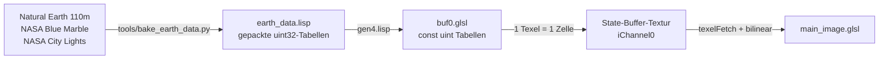

# Animierter Erd-Globus (`gen4.lisp`)

Ein Shadertoy-kompatibler Shader, der die Erde mit echten Kartendaten, Wolken,
Atmosphäre, Stadtlichtern und Markern darstellt. Die Kamera fährt als
Quaternionen-SLERP von Marker zu Marker. Erzeugt wird der GLSL-Code aus
S-Expressions mit `cl-cpp-generator2`, gerendert wird headless über EGL.

Die großen Validierungsbilder/GIFs bleiben absichtlich lokal und werden nicht versioniert. Sie lassen sich mit `run_earth.sh` beziehungsweise `tools/make_animation.py` reproduzieren.

---

## 1. Schnellstart

```bash
cd /workspace/src/cl-cpp-generator2/example/197_shadertoy

# alles in einem Schritt (Transpilieren, Bauen, Rendern, Benchmark):
sh run_earth.sh
# mit vorherigem Neu-Backen der Kartendaten (braucht Netzwerk):
sh run_earth.sh --bake
```

Einzelschritte:

```bash
# 1. Lisp -> GLSL  (schreibt shaders/earth/{common,buf0,main_image}.glsl)
sbcl --noinform --non-interactive --load gen4.lisp

# 2. Runner bauen
g++ -O3 headless_gpu_runner.cpp -lEGL -lGL -lpng -o headless_gpu_runner

# 3. Standbild zu einem beliebigen Zeitpunkt der Tour
./headless_gpu_runner --res 1920 1080 --frames 2 --time 6.0 \
  --shader-dir vulkan-shadertoy-x11/launcher/shaders/earth \
  --screenshot earth.png

# 4. animiertes GIF (48 Bilder, t = 0..8 s)
python3 tools/make_animation.py earth_tour.gif 0 8 48 480 300
```

> **Mindestauflösung 256 x 176.** Der State-Pass legt die Kartendaten als
> Textur-Block in seinen eigenen Puffer (siehe Abschnitt 4); darunter wird der
> Block abgeschnitten.

---

## 2. Was der Shader darstellt

| Element | Umsetzung |
| :--- | :--- |
| Planet | analytischer Strahl/Kugel-Schnitt (kein Raymarching), R = 1 |
| Küstenlinien | Natural-Earth-Landmaske, 256 x 128 Zellen mit 2 Bit Sub-Zellen-Deckung, bilinear + Rausch-Verzerrung |
| Bodenfarbe | NASA-Blue-Marble-Albedo (64 x 32, RGB565), linearisiert, mit Rauschvariation |
| Relief | Bump-Mapping: fBm + ridged Noise, im lokalen Tangentenraum differenziert (nur über Land) |
| Ozean | Tiefsee/Schelf-Verlauf aus einem weichgezeichneten Küstenfeld, Blinn-Phong-Sonnenglitzern mit Wellen-Sparkle |
| Schnee/Eis | Breitengrad + Höhe + Rauschen (Polkappen, Meereis) |
| Wolken | eigene, animierte fBm-Schale bei R = 1.018, Domain-Warping, Jetstream-Drift, Klimabänder, Selbstschattierung, Schattenwurf auf den Boden |
| Terminator | weicher Tag/Nacht-Übergang mit rötlichem Sonnenuntergangsband |
| Nachtseite | NASA-Stadtlichter (64 x 32), durch Hochfrequenz-Rauschen in Cluster aufgebrochen |
| Atmosphäre | Fresnel-Limb auf der Scheibe + exponentieller Halo außerhalb, sonnenseitig verstärkt |
| Hintergrund | 3 Lagen Hash-Sterne mit Funkeln, schwache Milchstraßen-Bande |
| Marker | Leuchtpunkt + pulsierende, auslaufende Ringe auf der Oberfläche, senkrechter Lichtstrahl, HUD-Punkte mit Fortschrittsbalken |

---

## 3. Kamerachoreografie: Quaternionen-SLERP

Die eigentliche Animation ist eine Interpolation zwischen *pro Marker
vorberechneten Orientierungs-Quaternionen*. Das Rechnen passiert zur
Generierzeit in Lisp, der Shader interpoliert nur noch:

1. Für jede Stadt wird die erdfeste Richtung bestimmt
   (`latlon->dir`, gleiche Konvention wie `dirToUV` im Shader):

   ```
   d = (cos(lat)·sin(lon), sin(lat), cos(lat)·cos(lon))
   ```

2. `q_align` dreht `d` auf die Bildschirmmitte (`+z`, Richtung Kamera) --
   kürzester Bogen über Kreuzprodukt und `atan2`.

3. Der verbleibende Rollfreiheitsgrad wird so gewählt, dass die Erdachse auf
   dem Bildschirm nach oben zeigt: mit `n = q_align·(0,1,0)` ist
   `φ = atan2(n_x, n_y)`, und `q = q_z(φ) · q_align`.

4. `gen4.lisp` prüft das Ergebnis vor dem Codegenerieren
   (`run-tour-tests`, 19 Asserts): Rundlauf lat/lon → Richtung → lat/lon,
   `qRot(q, d) == (0,0,1)`, `qRot(q,(0,1,0))_x == 0` mit `y > 0`,
   Einheitslänge sowie `qRot(a, qRot(b,v)) == qRot(a·b, v)`.

5. Im Shader (`common.glsl`) läuft pro Marker ein Segment von `TOUR_SEG = 4 s`:
   0.42 · Segment Verweilen, dann `smoothstep`-geführtes `qSlerp` zum nächsten
   Marker (mit Vorzeichenkorrektur für den kürzeren Bogen). Zusätzlich eine
   kleine Leerlauf-Drift, damit der Globus im Verweilen nicht steht, und ein
   Auszoomen (`camDist = 3.5 + 0.6·sin(π·ease)`) während der Fahrt.

Marker und Farben stehen als Liste in `gen4.lisp` -- Einträge ändern reicht,
die Quaternionen, die entrollten Marker-Schleifen und das HUD werden daraus
neu erzeugt:

```lisp
(defparameter *markers*
  '((:name "BERLIN"    :lat  52.520d0 :lon  13.405d0 :color (1.00 0.86 0.30))
    (:name "NEW YORK"  :lat  40.713d0 :lon -74.006d0 :color (0.35 0.90 1.00))
    ...))
```

Die sechs Markerbilder und die Falschfarben-Debugbilder wurden headless erzeugt; wegen ihrer Größe liegen sie nur lokal und sind per `.gitignore` ausgeschlossen. Eine Kontaktansicht kann mit `tools/make_animation.py` beziehungsweise den `--time`-Aufrufen aus `run_earth.sh` reproduziert werden.

---

## 4. Datenpfad: von echten Karten in den Shader



`tools/bake_earth_data.py` lädt die Quellen (einmalig nach `tools/cache/`),
rastert die Landpolygone, füllt die Albedo-Farben über die Küsten hinaus,
isoliert die Stadtlichter vom blauen Hintergrund der Vorlage und schreibt vier
gepackte Tabellen als Lisp-Datei:

| Tabelle | Raster | Kodierung | uint32-Wörter |
| :--- | :--- | :--- | ---: |
| Landmaske | 256 x 128 | 2 Bit Deckung | 2048 |
| Küstenfeld | 64 x 32 | 4 Bit, gaußgeglättet | 256 |
| Albedo | 64 x 32 | RGB565, 2 Zellen/Wort | 1024 |
| Stadtlichter | 64 x 32 | 4 Bit | 256 |
| | | **Summe** | **3584 (14 KB)** |

Zwei harte Grenzen des Treibers (NVIDIA RTX A4000, 610.57.04) prägen dieses
Layout:

* **> 16 KB konstante Daten pro Shader** ⇒ Linkfehler
  `C5041: cannot locate suitable resource to bind variable ... Possibly large
  array`. Gemessen: 3072 uint gehen, 4096 uint nicht mehr. Deshalb die
  kompakte Bitpackung (der Baker bricht oberhalb 4000 Wörtern selbst ab).
* **dynamisch indizierte `const uint[]`-Tabellen sind sehr langsam.** Im
  Render-Pass fielen pro Pixel 16 solcher Zugriffe an: 19.5 ms/Frame in 1080p.
  Ersetzt man nur die Tabellenzugriffe durch Arithmetik, bleiben 2.3 ms --
  die Tabellen selbst waren also der Flaschenhals.

Konsequenz: **die Tabellen werden im State-Pass (`buf0`) einmal pro Frame in
die RGBA32F-Textur entpackt** (jedes Texel liest höchstens ein Wort), und der
Render-Pass liest sie mit `texelFetch` aus `iChannel0`. Das Bild ist identisch,
die Kosten fallen von 19.5 ms auf 2.0 ms pro 1080p-Frame (≈ 9.6-fach).

Layout im State-Buffer (`common.glsl`):

| Texel | Inhalt |
| :--- | :--- |
| `(0,0)` | Orientierungs-Quaternion |
| `(1,0)` | `(aktiver Marker, Segmentphase, Kameradistanz, Ease)` |
| Zeilen 4..131, Spalten 0..255 | Landdeckung in `.r` |
| Zeilen 136..167, Spalten 0..63 | Küstenfeld in `.r` |
| Zeilen 136..167, Spalten 70..133 | Albedo in `.rgb` |
| Zeilen 136..167, Spalten 140..203 | Stadtlichter in `.r` |

---

## 5. Leistung (NVIDIA RTX A4000, Treiber 610.57.04)

400 Messframes, Zeitmessung mit `glFinish` pro Frame:

| Auflösung | MPixel/Frame | FPS | Mittel | 99. Perzentil | Pixeldurchsatz |
| :--- | ---: | ---: | ---: | ---: | ---: |
| 1280 x 720 | 0.92 | **1038** | 0.96 ms | 1.25 ms | 0.96 GPix/s |
| 1920 x 1080 | 2.07 | **494** | 2.02 ms | 2.33 ms | 1.02 GPix/s |
| 2560 x 1440 | 3.69 | **286** | 3.50 ms | 3.90 ms | 1.05 GPix/s |
| 3840 x 2160 | 8.29 | **129** | 7.74 ms | 8.89 ms | 1.07 GPix/s |

Zum Vergleich vor der Textur-Umstellung: 51 FPS in 1080p.

---

## 6. Änderungen am Runner (`headless_gpu_runner.cpp`)

* `--time <sekunden>` verschiebt `iTime` des ersten Frames. Da der State-Pass
  hier zustandsfrei ist, kostet ein Bild bei t = 22 s so zwei Frames statt
  1320.
* `glFinish()` **pro Frame** in der Simulationsschleife. Ohne Fence verwarf der
  Treiber lange Batches: ab ca. 860 Frames in 1440x900 kam ein leeres FBO
  (Alpha 0, RGB 0) zurück, während 800 Frames noch funktionierten.

---

## 7. Debug-Werkzeuge

`tools/debug_variant.sh` legt eine Falschfarben-Kopie des generierten Shaders
in `/tmp/earth_debug` ab. Der erste Ausdruck ersetzt `return lit;` in
`shadeSurface` (alle lokalen Größen dort sind sichtbar), der zweite die
Endfarbe in `mainImage`:

```bash
sh tools/debug_variant.sh "vec3(isLand, shelf, snow)"
sh tools/debug_variant.sh "" "vec3(clouds.w)"
./headless_gpu_runner --res 900 900 --frames 2 --time 2 \
  --shader-dir /tmp/earth_debug --screenshot /tmp/dbg.png
```

Damit wurden unter anderem gefunden: zu tief angesetzte Schneegrenze, ein
Albedo-Clamp, der helle Wüsten entsättigt und flach machte, sowie die
blockigen Stadtlicht-Rechtecke aus dem 64 x 32-Raster.

`tools/assemble_frag.py` baut dieselbe Fragment-Quelle zusammen, die der
Runner erzeugt (Prolog + `common.glsl` + Body), damit GLSL-Fehlerzeilen auf
echte Zeilennummern abbildbar sind.

---

## 8. Fallstrick im Codegenerator (behoben)

Mit `:omit-parens t` verlor ein negierter Ausdruck vor einer Division seine
Klammern:

```lisp
(exp (/ (- (- perp EARTH_R)) 0.055f0))
;; -> exp(-perp - EARTH_R / 5.50e-2F)      FALSCH (vor 2026-08-30)
;; -> exp(( -(perp-EARTH_R))/5.50e-2F)     korrekt (seit dem Fix)
```

Das ließ den Atmosphären-Halo verschwinden (`g ≈ e^-19`), sichtbar als dunkler
Ring am Rand. Ursache war ein Fehler in `paren*`: der intern erzeugte Operator
`-unary` fehlte in `*operators*`, weshalb der Operand des unären Minus als
Funktionsaufruf behandelt und ungeklammert emittiert wurde. Behoben in `c.lisp`,
abgedeckt von `t/02_paren_precedence/`; Details in
`plan/20260830_01_omit_paren_bug/walkthrough.md`.

Die hier verwendete Zwischenvariable bleibt trotzdem stehen — sie ist lesbarer
und vermeidet die (jetzt korrekten, aber redundanten) Klammern:

```lisp
(setf hgt (- perp EARTH_R)
      g (exp (* -21.5f0 hgt)))
;; -> g = exp(-21.50F * hgt);
```

Ebenso gilt: Gleitkommaliterale mit Exponent brauchen die Lisp-Schreibweise
`1.0f-7`; `1.0e-7f0` wird als Symbol gelesen und landet unverändert im GLSL.
